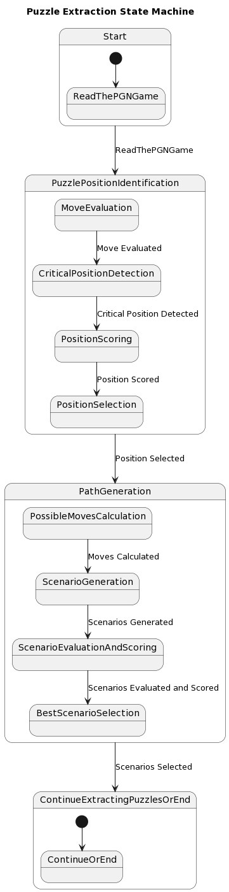

# Advanced Chess Tactics Trainer

## Table of Contents

- [Advanced Chess Tactics Trainer](#advanced-chess-tactics-trainer)
  - [Table of Contents](#table-of-contents)
  - [Project Description](#project-description)
  - [Features](#features)
  - [Settings](#settings)
  - [Puzzle Extraction Algorithm](#puzzle-extraction-algorithm)
  - [Database Schema](#database-schema)
  - [Resources](#resources)
  - [Puzzle Types](#puzzle-types)
  - [User Types](#user-types)
  - [Web Tools](#web-tools)

## Project Description

The Advanced Chess Tactics Trainer project aims to revolutionize chess training with an enriched, customizable, and comprehensive learning experience. Our trainer diverges from traditional learning paths and embraces the complexity of real-world chess scenarios. We believe that these scenarios do not always follow a single, winning path, and hence the trainer presents multi-path puzzles requiring in-depth analysis, strategy, and calculated risks. Along with an intelligent scoring system, interactive feedback, and customizable settings, this trainer delivers a unique learning journey for every user. The project harnesses powerful resources like the Lichess database, interactive chessboards, and chess algorithms to redefine the way chess training is conducted and pave the way for a new generation of chess masters.

## Features

The trainer includes a comprehensive list of features tailored for diverse learning needs:

- **Partial Credit:** Avoid the frustration of not getting any points despite having most moves right.
- **Visually Play Each Line:** Visualize every move in the chess puzzle.
- **Splintering:** Discover alternate paths and outcomes.
- **Timer:** Challenge yourself against the clock.
- **Teacher Account:** Customizable and trackable learning for classrooms.
- **Edit Line:** Modify your moves and learn from the changes.
- **No Winning Move Button:** Learn that not all positions have winning moves.
- **Point Out Line:** Get tips on the most promising lines.
- **Extra Credit Long Line:** Rewards for deep and insightful analysis.
- **Beginner Mode:** Gentle learning curve for beginners.

## Settings

The trainer allows a high degree of customization to provide a tailored learning experience:

- **Depth:** Adjust the depth of the puzzle.
- **Include Puzzles With No Solution:** Learn to recognize situations where no winning move exists.
- **Input Method:** Choose from moving pieces, click/drag without pieces moving, or typing moves.
- **ListView Vs TreeView:** Select the most intuitive display of multiple variations.
- **Timer Length:** Set the timer length for an increased challenge.

## Puzzle Extraction Algorithm

The project uses an advanced state machine algorithm for extracting instructive puzzles from raw chess games. For more details, see the state machine flow chart image at the top of the readme.

## Database Schema

The application uses a database with four tables:

1. `games`
2. `puzzles`
3. `moves`
4. `alternate_moves`

For detailed information about each table's columns, refer to the `schema` section in the project description.

## Resources

The project leverages several resources:

- **Chess.js Library:** Used for move legality, path finder, and as a foundation for the trainer platform. [Learn more](https://github.com/jhlywa/chess.js)
- **Stockfish Engine:** Used for suggesting best next moves, estimating skill level, move legality, and puzzle extraction. [Learn more](https://pypi.org/project/stockfish/)
- **Lichess Database:** Source for puzzles and games. [Learn more](https://database.lichess.org/#puzzles)

## Puzzle Types

We categorize our puzzles into five types: imbalance, tactical, positional advantage, defense, and no best line. This variety ensures a well-rounded chess learning experience.

## User Types

We offer two types of accounts, one for students and another for teachers, to cater to both independent learners and classrooms.

## Web Tools

We use interactive chessboards to provide a visually appealing and user-friendly interface. [Learn more](https://www.apronus.com/chess/pgnviewer/)